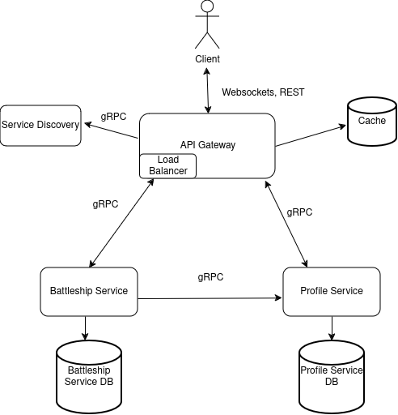

# Multiplayer Battleship Game

## Application Suitability

Here are key reasons why microservices are ideal for this project:

1. **Separation of Game Logic and User Management:**:

   - Game logic (such as managing moves and game states) and user-related tasks (like authentication, registration, and scorekeeping) are distinct responsibilities. Breaking them into independent services makes the system easier to maintain and scale as needed.

2. **Enhanced Availability**:

   - Distributed systems ensure higher availability by isolating failures. If the authentication service encounters an issue, it won’t affect the service that deals with game logic, so players that are already in a game won't encounter issues. This modularity improves the overall resilience of the system.

3. **Improved Scalability**:

   - Different components like matchmaking, game sessions, and player stats will experience varying loads. Microservices allow each of these components to scale independently. For example, the API Gateway managing WebSocket connections can handle spikes in player activity, while services like matchmaking or game sessions can be scaled separately to ensure smooth performance during peak gaming times. This flexibility ensures that even when a large number of players are looking for matches or playing simultaneously, the rest of the system remains unaffected.

4. **Optimized Real-Time Communication**:

- Real-time updates are crucial for synchronized gameplay. By isolating real-time tasks in a service the system ensures swift communication of moves and game state changes. Meanwhile, other services like managing user profiles and authentication would be separate, keeping gameplay smooth and responsive even with many concurrent players.

Real-world examples of projects that are similar and employ microservices:

- **Hearthstone (by Blizzard Entertainment)**: A digital collectible card game that supports online multiplayer matches, player progression, and real-time interactions. It leverages microservices to handle game logic, player data, and match-making.

- **Among Us (by Innersloth)**: A multiplayer game that involves real-time interaction, player roles, and in-game communication. It uses microservices to handle game sessions, player data, and real-time chat.

## Service Boundaries

Architecture diagram:

<p align="center">
  
</p>

### API Gateway

The API Gateway is the entry point for all client requests and performs several key functions:

- **Routing**: Directs incoming requests to the appropriate microservice based on the request URL and method.
- **Load Balancing**: Distributes incoming traffic across multiple instances of microservices to ensure even load and high availability.
- **Caching**: Uses Redis to store frequently accessed data, improving response times and reducing load on backend services.
- **WebSocket Management**: Establishes and manages WebSocket connections for real-time communication between clients and the services.
- **Service Discovery**: Integrates with a service registry to discover and route requests to the available instances of microservices.

### Battleship Service

The Battleship Service is responsible for handling the core game functionality, including:

- **Game Logic**: Manages the rules and mechanics of the Battleship game, including turn management, hit/miss calculations, and game state updates.
- **Real-Time Updates**: Provides real-time updates about the game state to clients via the gateway.

### Profile Service

The Profile Service handles user-related functionality and data management, including:

- **Authentication & Registration**: Manages user authentication, registration, and login processes.
- **Score Tracking**: Tracks and updates user scores and game history, communicating with the Battleship Service via gRPC to synchronize game-related data.

### Technology stack

1. API Gateway
   - Language: Javascript (Node.js)
   - Caching: Redis
2. Battleship Service
   - Language: Java
   - Database: MongoDB
3. Profile Service
   - Language: Java
   - Database: PostgreSQL

### Communication patterns

REST will be used for client-API Gateway communication due to its simplicity and broad compatibility for standard API interactions, while WebSockets handle real-time updates and bidirectional communication essential for live gameplay. gRPC will be used for service-to-service communication because it offers high performance with low latency, efficient binary serialization which is ideal for complex, high-throughput interactions between microservices.

### Data Management

## 1. Profile Service (User Authentication and Management)

#### 1.1 POST /auth/register

- **Description**: Registers a new user.

  - **Request**:

  ```json
  {
    "username": "string",
    "password": "string"
  }
  ```

  - **Response (success)**:

  ```json
  {
    "message": "User registered successfully.",
    "user_id": "string"
  }
  ```

  - **Response (error)**:

  ```json
  {
    "error": "Username already taken."
  }
  ```

#### 1.2 POST /auth/login

- **Description**: Logs in an existing user and issues a JWT token.

  - **Request**:

  ```json
  {
    "username": "string",
    "password": "string"
  }
  ```

  - **Response (success)**:

  ```json
  {
    "token": "jwt_token",
    "user_id": "string"
  }
  ```

  - **Response (error)**:

  ```json
  {
    "error": "Invalid username or password."
  }
  ```

#### 1.3 GET /auth/profile

- **Description**: Retrieves the profile data for the authenticated user (based on the JWT token).
- **Headers**:

  ```json
  {
    "Authorization": "Bearer jwt_token"
  }
  ```

  - **Response**:

  ```json
  {
    "user_id": "string",
    "username": "string",
    "total_games": 20,
    "wins": 12,
    "losses": 8
  }
  ```

#### 1.4 POST /auth/update-profile

- **Description**: Updates the user profile based on game results (e.g., win/loss).

  - **Request**:

  ```json
  {
    "user_id": "string",
    "result": "win" //or "loss"
  }
  ```

  - **Response**:

  ```json
  {
    "message": "Profile updated successfully.",
    "total_games": 21,
    "wins": 13,
    "losses": 8
  }
  ```

## 2. Battleship Service (Game Management)

#### 2.1 POST /game/create

- **Description**: Create a new game, initializing Player 1.

- **Headers**:

  ```json
  {
    "Authorization": "Bearer jwt_token"
  }
  ```

  - **Request**:

  ```json
  {
    "player_id": "string"
  }
  ```

  - **Response**:

  ```json
  {
    "game_id": "string",
    "player_grid": {
      "grid_with_ships": [
        { "x": 0, "y": 0, "ship": "Carrier", "orientation": "horizontal" },
        { "x": 2, "y": 1, "ship": "Battleship", "orientation": "vertical" },
        { "x": 5, "y": 3, "ship": "Cruiser", "orientation": "horizontal" },
        { "x": 7, "y": 5, "ship": "Submarine", "orientation": "vertical" },
        { "x": 9, "y": 6, "ship": "Destroyer", "orientation": "horizontal" }
      ]
    },
    "grid_size": 10,
    "status": "waiting_for_opponent"
  }
  ```

#### 2.2 POST /game/join

- **Description**: Player 2 joins an existing game.

- **Headers**:

  ```json
  {
    "Authorization": "Bearer jwt_token"
  }
  ```

  - **Request**:

  ```json
  {
    "game_id": "string",
    "player_id": "string"
  }
  ```

  - **Response**:

  ```json
  {
    "game_id": "string",
    "player_grid": {
      "grid_with_ships": [
        { "x": 1, "y": 0, "ship": "Carrier", "orientation": "vertical" },
        { "x": 3, "y": 2, "ship": "Battleship", "orientation": "horizontal" },
        { "x": 6, "y": 4, "ship": "Cruiser", "orientation": "vertical" },
        { "x": 8, "y": 7, "ship": "Submarine", "orientation": "horizontal" },
        { "x": 4, "y": 9, "ship": "Destroyer", "orientation": "vertical" }
      ]
    },
    "grid_size": 10,
    "status": "in_progress"
  }
  ```

#### 2.3 POST /game/attack

- **Description**: Player sends attack coordinates to attack an opponent’s grid.

- **Headers**:

  ```json
  {
    "Authorization": "Bearer jwt_token"
  }
  ```

  - **Request**:

  ```json
  {
    "game_id": "string",
    "attacker_id": "string",
    "coordinates": {
      "x": 5,
      "y": 3
    }
  }
  ```

#### 2.4 POST /game/leave

- **Description**: A player leaves an ongoing game.

- **Headers**:

  ```json
  {
    "Authorization": "Bearer jwt_token"
  }
  ```

  - **Request**:

  ```json
  {
    "game_id": "string",
    "player_id": "string"
  }
  ```

  - **Response (for player leaving)**:

  ```json
  {
    "message": "You have left the game.",
    "status": "player_left"
  }
  ```

  - **Response (for remaining player)**:

  ```json
  {
    "message": "Opponent has left the game.",
    "status": "game_abandoned"
  }
  ```

## 3. WebSocket Events

#### 3.1 game_started

- **Description**: Broadcasted when Player 2 joins the game.

- **Event Payload (for both players):**:

  ```json
  {
    "event": "game_started",
    "message": "Player 2 has joined. Game is starting.",
    "your_turn": true //or false
  }
  ```

#### 3.2 attack_result

- **Description**: Sent to both players when an attack is made.

- **Event Payload**:

  ```json
  {
    "game_id": "string",
    "attacker_id": "string",
    "coordinates": {
      "x": 5,
      "y": 3
    },
    "hit": true, //or false
    "ship_destroyed": true, //or false
    "destroyed_ship": "Carrier", //or "Battleship" | "Cruiser" | "Submarine" | "Destroyer" | "none"
    "opponent_ships_remaining": 3,
    "status": "in_progress"
  }
  ```

#### 3.3 game_over

- **Description**: Broadcasted when all ships of one player are destroyed.

- **Event Payload (for Winner)**:

  ```json
  {
    "event": "game_over",
    "message": "You have won the game!",
    "status": "victory"
  }
  ```

- **Event Payload (for Loser)**:

  ```json
  {
    "event": "game_over",
    "message": "You have lost the game.",
    "status": "defeat"
  }
  ```

### Deployment and Scaling

Each component, such as the two microservices, API Gateway, service discovery, Redis, and the databases, will have its own Docker image. These images will be used to create and run containers, which can be deployed and scaled independently. Docker Compose can manage these containers, ensuring they can communicate with each other as required. Docker handles the networking and communication between containers, allowing for flexible scaling and deployment.
